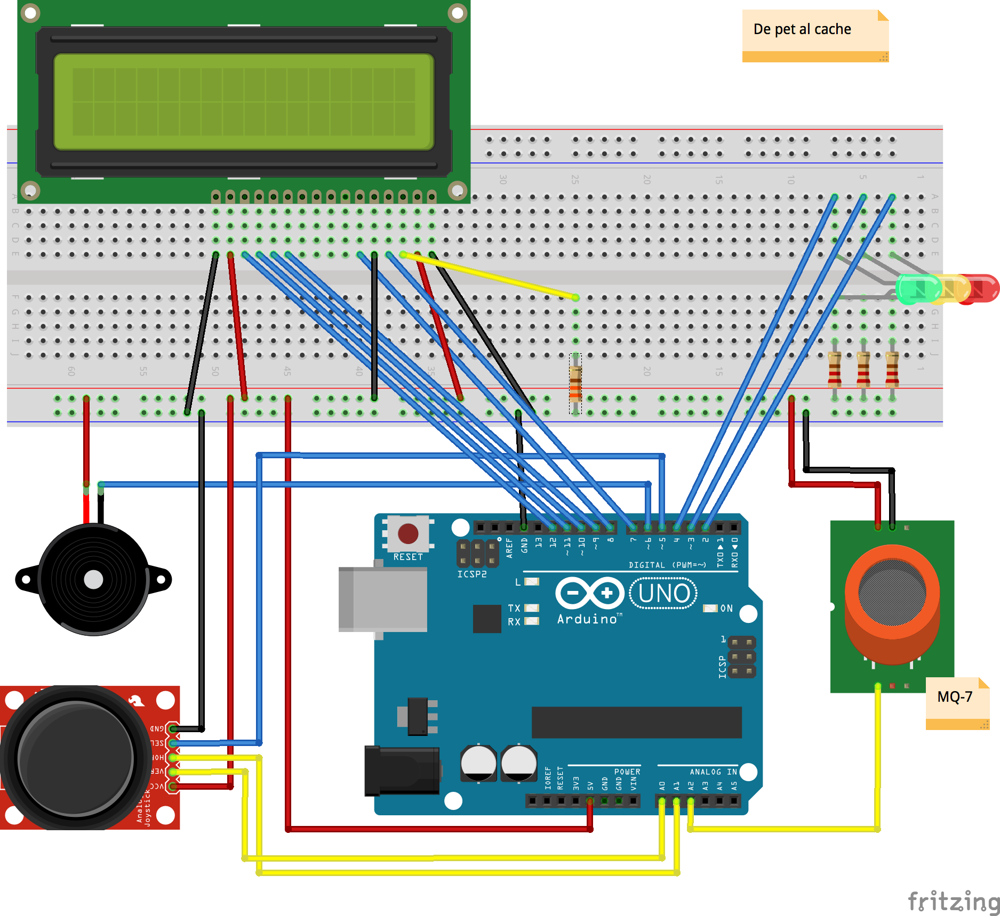

# De pet al cache!

This project is a geocache made with an Arduino and some sensors.
Geocachers must fart in order to log their visit.

## Hardware

Missing description. See the [fritzing diagram](doc/design.fzz).

## Software

Missing description.

## Requirements

Because Arduino does not have the STL, the following library has
to be added in the Arduino IDE: https://github.com/marcusrugger/functional-vlpp
